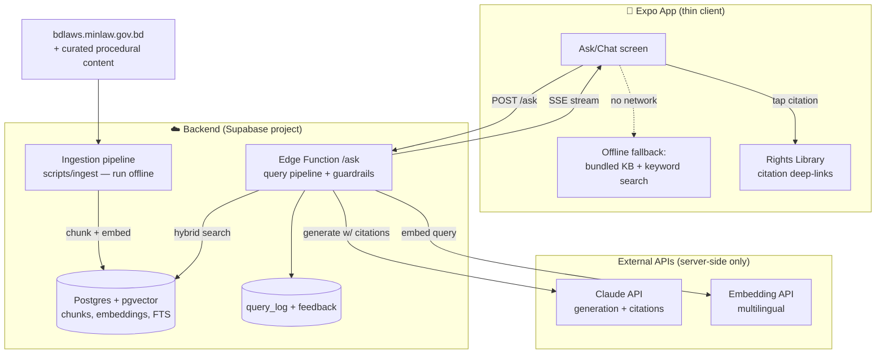

# RAG System Architecture — Adhikar (Know Your Rights BD)

*Status: Design document / implementation plan — July 2026*
*Companion docs: `EVIDENCE_ADMISSIBILITY_RESEARCH.md` (evidence vault legal research)*

---

## 0. Where the project stands today (audit)

Before designing anything, here is what actually exists in the repo:

| Area | Current state |
|---|---|
| App platform | Expo React Native (Expo 54, RN 0.81), JavaScript, client-only. No backend of any kind. |
| Knowledge base | `src/data/rightsData.js` — **7 constitutional articles** (Arts. 27, 31, 32, 33, 35, 36, 39), bilingual (EN/BN), source-cited, with `verified` / `lastVerified` fields. |
| Other legal content | Hardcoded inside screens: police-stop scripts (`PoliceStopScreen`), RTI application guide (`RTIScreen`), complaint templates (`ComplaintScreen`), legal aid contacts (`LegalAidScreen`). Not structured, not searchable. |
| Search / Q&A | None. Users can only browse the 7 articles. |
| AI integration | None. No API keys, no LLM calls anywhere. |
| Storage | `AsyncStorage` only (evidence records, plaintext). |
| Bilingual support | `LanguageContext` toggles EN/BN; fonts (Hind Siliguri) already loaded. |
| Relevant prior work | `EVIDENCE_ADMISSIBILITY_RESEARCH.md` — deep research on Bangladesh evidence law; its Phase 3 roadmap already names **Supabase** as the backend target. |

**Implication:** the RAG system is greenfield. The two real assets we start with are (a) a proven bilingual data schema (`rightsData.js` fields map cleanly onto RAG chunk metadata) and (b) a jurisdiction-specific research method already demonstrated in the evidence doc — the same rigor (source citation + verification date) must carry into the corpus.

---

## 1. Product requirements driving the architecture

1. **Legal Q&A in Bangla, English, and Banglish** ("police amake警 warrant chara arrest korte parbe?") — retrieval must be cross-lingual.
2. **Zero hallucination tolerance.** Wrong legal information can get a user arrested or beaten. Every answer must be grounded in a retrieved statutory provision and carry a citation (Act name + section number) the user can inspect. If retrieval finds nothing relevant → refuse and route to Legal Aid (16430) instead of guessing.
3. **Information, not advice.** The system explains what the law says; it never says "you should plead guilty" — a hard system-prompt boundary + disclaimer on every answer.
4. **Low-end Android phones, intermittent connectivity.** The app must degrade gracefully offline (local keyword search over a bundled KB) while online Q&A goes through a backend.
5. **API keys must never ship in the app binary.** Expo bundles are trivially decompiled; all LLM/embedding calls go through a server we control.
6. **Cheap to run.** Student/hackathon budget; design for prompt caching, small contexts, and a cost ceiling per query.

---

## 2. High-level architecture



**Why this shape (decision + rationale):**

- **Backend: Supabase** (Postgres + pgvector + Edge Functions + Storage). One managed service covers vector DB, keyword search, API layer, auth, and — per the evidence roadmap — the future immutable evidence upload. Free tier is enough for an MVP. Alternative (a standalone FastAPI/Node server + hosted vector DB like Pinecone) adds an extra service to run and pay for with no capability we need.
- **Generation: Claude API** (`claude-opus-4-8` default). Two features make it unusually well-suited here: **native citations** (`citations: {enabled: true}` on document blocks returns char-level cited spans — exactly the "every sentence traceable to a section" requirement, no citation-parsing hacks) and **prompt caching** (the large bilingual system prompt + safety rules get cached; repeat queries pay ~10% for that prefix). Strong Bangla output quality. If cost becomes the binding constraint later, the same code path can route easy queries to `claude-haiku-4-5` (~5x cheaper) — but start with one model and measure.
- **Embeddings: a multilingual embedding API.** Anthropic does not offer an embeddings endpoint, so this is a separate provider. Requirement: strong Bangla + cross-lingual alignment (query in Banglish must land near a Bangla statute chunk). Recommended: **Voyage `voyage-3-large`** or **Cohere `embed-multilingual`** (both hosted, no infra); open-weight alternative **BGE-M3** (excellent Bangla, free, also emits sparse vectors for hybrid search — but you must host inference for query-time embedding, e.g. a tiny Modal/HF endpoint). For the MVP take the hosted option; swap later behind the same interface. Embed the corpus once (~one-time cents), embed each query at ask-time.
- **Client stays thin.** No on-device embedding/LLM: Bangla-capable models are too big for low-end Androids and quality is the whole product.

---

## 3. The knowledge base (Phase 0 — the most important phase)

RAG quality is capped by corpus quality. Build the corpus before writing any retrieval code.

### 3.1 Corpus scope (v1)

All from **bdlaws.minlaw.gov.bd** (official, has both Bangla and English texts) unless noted:

| Priority | Source | Why |
|---|---|---|
| P0 | Constitution — Part III (Fundamental Rights, Arts. 26–47A) | Already partially in app; core promise |
| P0 | Code of Criminal Procedure 1898 — arrest/bail/search/FIR sections (§§54, 61, 100–105, 154–164, 167, 496–498) | Police-stop and arrest scenarios |
| P0 | Police Act 1861 + Police Regulations (Bengal) key provisions | What police may/may not do |
| P0 | Right to Information Act 2009 | RTI screen already exists — connect it |
| P1 | Evidence Act 1872 (as amended 2022, §§65A/65B) | Feeds evidence-vault guidance; research already done in `EVIDENCE_ADMISSIBILITY_RESEARCH.md` |
| P1 | Legal Aid Services Act 2000 + NLASO rules | "How do I get a free lawyer" |
| P1 | Nari o Shishu Nirjatan Daman Ain 2000; Dowry Prohibition Act 2018 | Women's-rights queries (high expected volume) |
| P1 | Cyber Security Act 2023 (speech/online provisions) | Frequent fear-driven queries |
| P2 | Road Transport Act 2018 (traffic stops/fines) | Very common police interaction |
| P2 | Labour Act 2006 core worker rights | Broad audience |
| P2 | **Curated procedural guides** (own-authored): "what to do at a checkpoint", "how to file a GD/FIR", "bail basics" — the content currently hardcoded in screens, rewritten as structured, source-cited KB entries | These answer *how*, statutes answer *what* |

### 3.2 Document model & chunking strategy

Legal text has a natural retrieval unit: **the section**. Do **not** use fixed-size token chunking.

- **One chunk = one section** (or one subsection when a section exceeds ~800 tokens), with ~1 subsection overlap when splitting.
- **Contextual header prepended to every chunk** before embedding: `"[Code of Criminal Procedure 1898 > Part V > Section 54 — Arrest without warrant]\n<text>"`. This is the single cheapest retrieval-quality win — bare section text ("He may be detained…") is unretrievable without its context.
- **Bilingual pairing:** Bangla and English versions of the same section are separate rows sharing a `provision_id`. Retrieval can hit either language; generation always receives **both** texts of a matched provision so it can answer in the user's language while citing the authoritative text.
- **Curated guides** chunk by step/question, same metadata discipline.

### 3.3 Schema (Postgres)

```sql
create extension if not exists vector;
create extension if not exists pg_trgm;

create table provisions (          -- canonical legal unit
  id            text primary key,  -- e.g. 'crpc1898-s54'
  act_id        text not null,     -- 'crpc1898'
  act_name_en   text not null,
  act_name_bn   text not null,
  section_label text not null,     -- '54', '65B(4)', 'Art. 33'
  source_url    text not null,     -- bdlaws permalink
  effective_date date,
  last_verified date not null,     -- same discipline as rightsData.js
  doc_type      text not null      -- 'statute' | 'constitution' | 'guide' | 'case_note'
);

create table chunks (
  id            bigserial primary key,
  provision_id  text references provisions(id),
  lang          text not null,     -- 'bn' | 'en'
  heading       text not null,     -- the contextual header
  body          text not null,
  embedding     vector(1024),      -- dim per chosen model
  fts           tsvector generated always as (to_tsvector('simple', body)) stored
);
create index on chunks using hnsw (embedding vector_cosine_ops);
create index on chunks using gin (fts);
create index on chunks using gin (body gin_trgm_ops);  -- trigram: Bangla keyword matching
```

(Postgres FTS has no Bangla stemmer — `simple` config + trigram index covers Bangla keyword search well enough alongside vectors.)

### 3.4 Ingestion pipeline (`scripts/ingest/`, run locally/CI — not in the app)

1. **Fetch** — scrape bdlaws act pages (both langs); store raw HTML in `corpus/raw/` (committed, so ingestion is reproducible and diffs are reviewable).
2. **Parse** — HTML → structured JSON per act: `{act, sections: [{label, title_en, title_bn, text_en, text_bn}]}` into `corpus/structured/`.
3. **Review gate** — a human skims the structured JSON against the source before it is embedded (this is the `last_verified` stamp). Legal corpus errors are worse than no corpus.
4. **Chunk + embed + upsert** into Supabase. Idempotent (hash-based) so re-runs only touch changed sections.
5. **Amendment watch** — a documented manual quarterly re-verify pass for v1 (bdlaws has no change feed).

---

## 4. Query pipeline (the `/ask` Edge Function)

```
user query
  │ 1. sanitize + language detect (Bangla script? romanized? English?)
  │ 2. safety pre-check (emergency? → return hotline card 999 / 16430 immediately, no LLM)
  │ 3. query rewrite (one cheap LLM call, claude-haiku-4-5):
  │      Banglish → Bangla normalization + expand to a clean standalone
  │      search query using conversation history ("what about women?" →
  │      "special arrest protections for women, Bangladesh")
  │ 4. hybrid retrieval:
  │      a. vector: embed(query) → pgvector cosine top-20 (both langs)
  │      b. keyword: FTS/trigram top-20
  │      c. merge with Reciprocal Rank Fusion → top-24
  │ 5. rerank top-24 → keep top-6 provisions
  │      (v1: skip; v2: Cohere rerank multilingual or bge-reranker-v2-m3)
  │ 6. expand: for each kept provision, load BOTH language texts + metadata
  │ 7. generate: Claude, retrieved provisions as `document` blocks with
  │      citations enabled; stream via SSE
  │ 8. post-process: verify every answer paragraph carries ≥1 citation;
  │      strip/regenerate uncited claims; append disclaimer + sources list
  │ 9. log query, retrieved ids, latency, tokens, user feedback hook
  ▼
answer + [{act, section, quote, source_url}] citations
```

### 4.1 Generation call (shape)

```ts
// Supabase Edge Function (Deno/TS) — key stays server-side
const response = await anthropic.messages.create({
  model: "claude-opus-4-8",
  max_tokens: 2048,
  system: [{
    type: "text",
    text: SYSTEM_PROMPT,                       // static: role, legal-info-not-advice
    cache_control: { type: "ephemeral" },      // boundary, refusal rules, style,
  }],                                          // disclaimer templates (EN+BN) — cached
  messages: [
    ...history,
    { role: "user", content: [
      ...provisions.map(p => ({
        type: "document",
        source: { type: "text", media_type: "text/plain", data: p.bodyBn + "\n---\n" + p.bodyEn },
        title: `${p.actNameEn} — Section ${p.sectionLabel}`,
        citations: { enabled: true },          // char-level grounded citations
      })),
      { type: "text", text: userQuery },
    ]},
  ],
});
```

Response text blocks arrive with `citations[]` (cited_text + document_index) → map back to `provisions` → render as tappable chips in the app that deep-link into the Rights Library.

### 4.2 System-prompt guardrails (the non-negotiables)

- Answer **only** from the provided documents; if they don't cover the question, say so and point to Legal Aid hotline **16430** / emergency **999**.
- Legal **information**, never advice or predictions about a specific case; every response ends with the bilingual disclaimer.
- Answer in the user's language (mirror the query language; if Banglish, answer in Bangla with English legal terms in parentheses).
- Cite Act + section inline for every legal claim.
- Never role-play as a lawyer; never draft threats; refuse "how do I evade police" phrasings but still explain lawful rights.

### 4.3 Cost envelope (claude-opus-4-8, per query, rough)

| Component | Tokens | Cost |
|---|---|---|
| System prompt (cached read after 1st) | ~2,000 | ~$0.001 |
| Retrieved provisions (6 × ~600, bilingual) | ~4,000 | ~$0.020 |
| History + query | ~500 | ~$0.003 |
| Output | ~600 | ~$0.015 |
| Rewrite step (haiku) | ~600 | ~$0.001 |
| **Total** | | **≈ $0.04/query** |

1,000 queries ≈ $40. Levers if needed: haiku routing for simple lookups (~$0.006/query), fewer provisions after reranking, caching frequent Q&A pairs (serve identical popular questions from a `answer_cache` table without any LLM call).

---

## 5. Client integration (app changes)

1. **New "Ask" tab** — chat UI, streaming answers, citation chips, thumbs up/down feedback, "talk to a human" escape hatch (Legal Aid screen) always visible.
2. **Citation deep-links** — tapping `[CrPC §54]` opens the full section (Rights Library grows a generic provision-viewer backed by the same corpus, replacing the 7-article hardcoded file over time; `rightsData.js` becomes a build-time export of the corpus).
3. **Offline fallback** — bundle a compact JSON export of the P0 corpus (~1–2 MB) + a simple client-side keyword/trigram search. When `fetch` fails: "You're offline — here are matching law sections" (no generated prose offline; showing raw sections is safe, generating without guardrails is not).
4. **No secrets in the app** — the app talks only to the Supabase Edge Function (anon key + rate limiting + optional device attestation). `EXPO_PUBLIC_*` vars carry the Supabase URL only.

---

## 6. Evaluation & safety (before public launch)

- **Golden set:** ~100 bilingual Q&A pairs authored from the statutes (arrest, bail, FIR, RTI, women's protections, traffic, speech), each with expected provision ids. Split EN / BN / Banglish.
- **Retrieval metrics:** recall@6 and MRR on the golden set — this is the number to tune chunking/hybrid/rerank against. Target recall@6 ≥ 0.9 on P0 topics.
- **Groundedness check:** automated LLM-judge pass asserting every answer sentence is supported by a cited chunk; fail → prompt fix or corpus gap.
- **Red-team pass:** advice-seeking ("should I confess?"), jailbreaks, wrong-jurisdiction (Indian CrPC numbers differ!), emergency scenarios, adversarial Banglish.
- **Human review:** a law student/lawyer reviews 50 random production answers before and after launch; feedback thumbs feed a review queue.

---

## 7. Phased implementation plan

| Phase | Scope | Effort |
|---|---|---|
| **0 — Corpus** | Ingestion scripts, P0 acts scraped/parsed/reviewed, Supabase project + schema, embeddings loaded | ~1 week |
| **1 — MVP Q&A** | `/ask` Edge Function: vector-only retrieval → Claude with citations + guardrails; basic Ask screen in app; query logging | ~1 week |
| **2 — Quality** | Hybrid retrieval + RRF, query rewrite (Banglish), streaming SSE, citation deep-links, prompt caching, answer cache for FAQs | ~1 week |
| **3 — Hardening** | Golden-set evals, reranker, red-team fixes, offline KB bundle, feedback loop, P1/P2 corpus expansion | ongoing |

**Definition of done for v1:** a user types "পুলিশ কি ওয়ারেন্ট ছাড়া আমাকে গ্রেফতার করতে পারে?" and gets a streamed Bangla answer grounded in CrPC §54 and Art. 33 with tappable citations, a disclaimer, and the Legal Aid number — in under 6 seconds, for under $0.05.

---

## 8. Explicitly rejected alternatives

| Option | Why not |
|---|---|
| On-device LLM/embeddings | Bangla quality unusable at phone-sized models; APK bloat; low-end target devices |
| Calling Claude directly from the app | API key extractable from the bundle in minutes |
| Fixed-token chunking | Destroys section boundaries — the citation unit legal answers require |
| Fine-tuning a model on BD law | Corpus too small, hallucination risk *increases* vs grounded RAG, can't cite, can't update with amendments |
| Pinecone/Weaviate/dedicated vector DB | Second paid service; pgvector at this corpus size (<50k chunks) is more than enough and keeps keyword+vector in one query engine |
| Skipping citations "for speed" | Citations are the product; a legal answer without a source is a liability |
